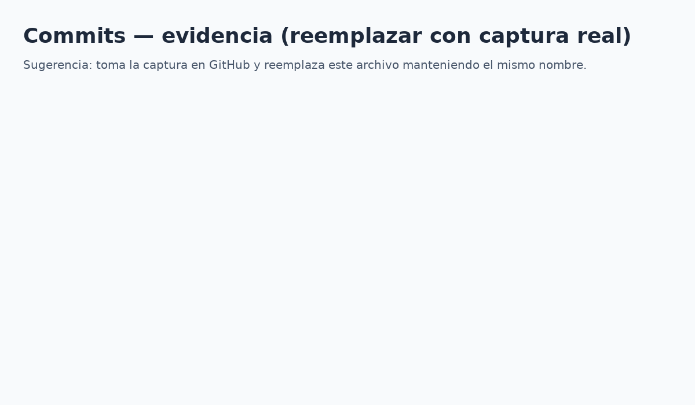
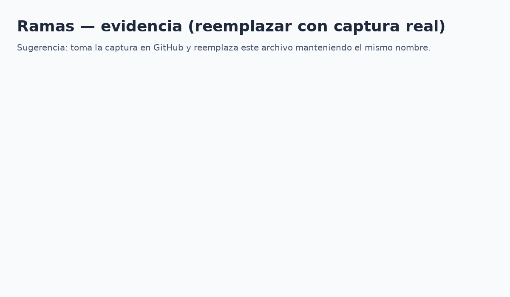

# ElectroShop (Flutter) — Control de Versiones

**Equipo:**  
- Emanuel (PO/Scrum Master)  
- Julio (Dev/Tester)

**Tema:** Tienda de componentes electrónicos para PC (CPU, GPU, motherboards, RAM, SSD).

## Vistas incluidas (solo UI)
- Catálogo, Detalle de producto, Carrito, Checkout, Login, Estado de pedido, Categorías, Perfil.
- Prototipo navegable en Flutter (mock de datos y navegación).

## Arquitectura


## Wireframes (todas las pantallas en una imagen)


## Cómo correr el proyecto
```bash
flutter pub get
flutter run
```

## Evidencia de control de versiones
(Agrega tus capturas aquí cuando hagas los commits y ramas en GitHub)

- Historial de commits  
  
- Ramas (si aplican)  
  

## Enlaces
- Repositorio público: **(agrega aquí la URL de tu repo)**

---

_Última actualización: 2025-09-19_
